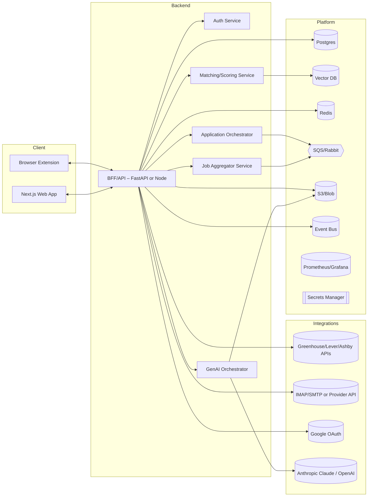

```mermaid
flowchart LR
  subgraph Client
    Web[Next.js Web App]
    Ext[Browser Extension]
  end
  subgraph Backend
    BFF[BFF/API – FastAPI or Node]
    Auth[Auth Service]
    Jobs[Job Aggregator Service]
    Match[Matching/Scoring Service]
    Gen[GenAI Orchestrator]
    Apply[Application Orchestrator]
  end

  subgraph Infra[Platform]
    DB[(Postgres)]
    Vec[(Vector DB)]
    Cache[(Redis)]
    Queue{{SQS/Rabbit}}
    Storage[(S3/Blob)]
    Events[(Event Bus)]
    Metrics[(Prometheus/Grafana)]
    Secrets[[Secrets Manager]]
  end

  subgraph Integrations
    ATS[(Greenhouse/Lever/Ashby APIs)]
    Email[(IMAP/SMTP or Provider API)]
    IdP[(Google OAuth)]
    LLM[(Anthropic Claude / OpenAI)]
  end

  Web <--> BFF
  Ext <--> BFF

  BFF --> Auth
  BFF --> Jobs
  BFF --> Match
  BFF --> Gen
  BFF --> Apply

  Jobs --> Queue
  Apply --> Queue
  Match --> Vec
  Gen --> Storage

  BFF --> DB
  BFF --> Cache
  BFF --> Storage
  BFF --> Events

  BFF --> ATS
  BFF --> Email
  BFF --> IdP
  Gen --> LLM
```
